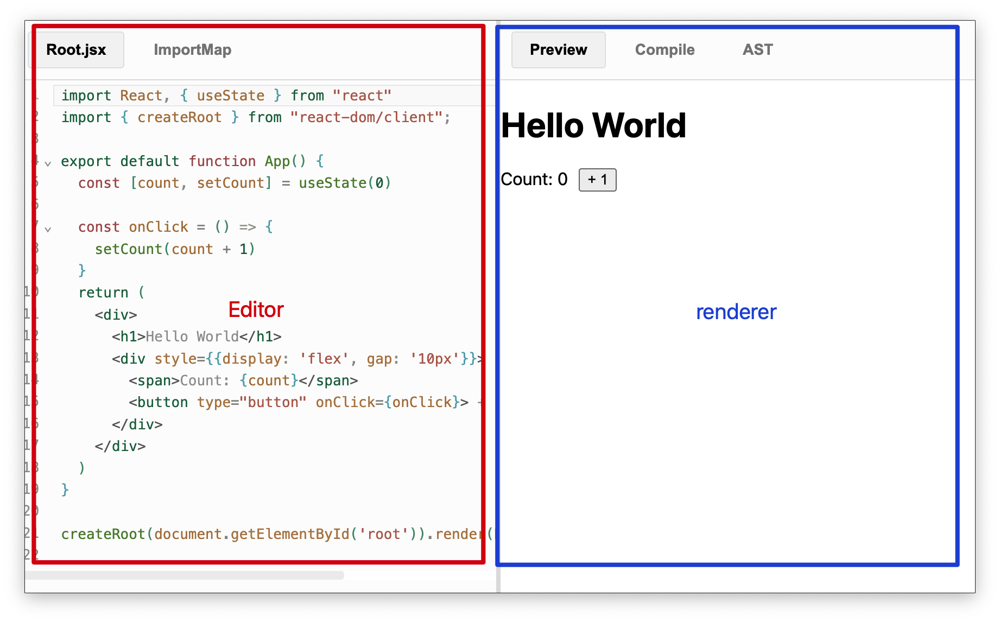
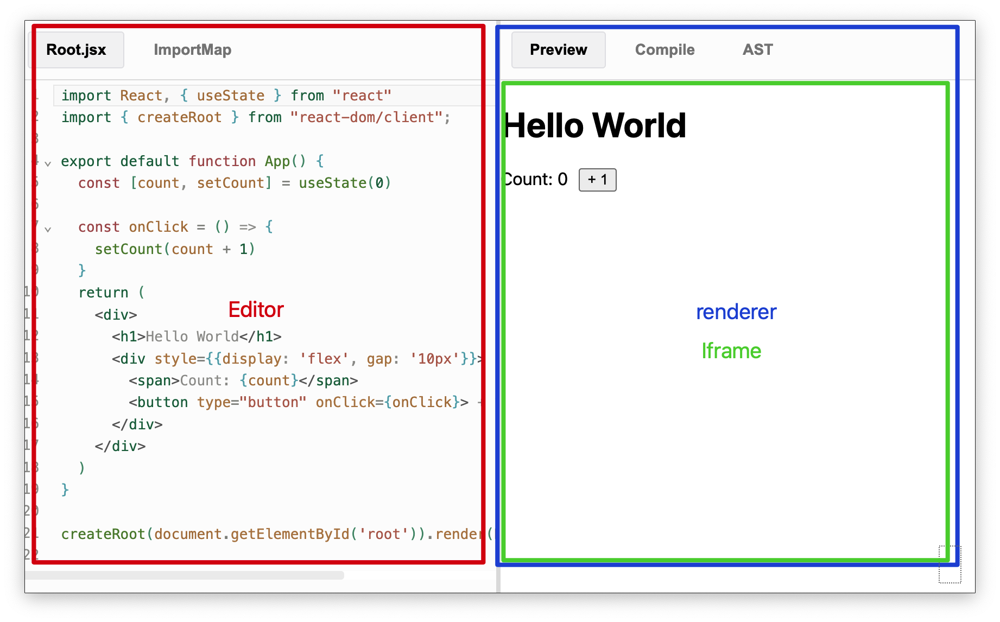
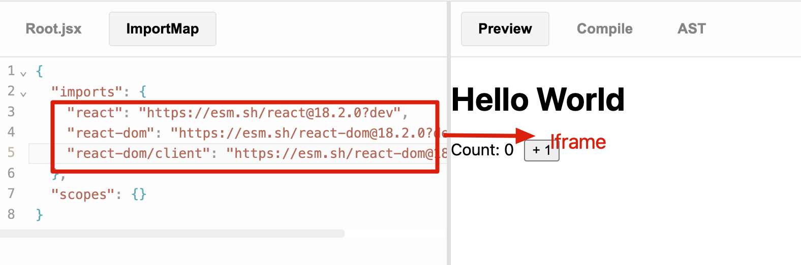

# Detail

Analysis

<v-clicks>

- **layouts**
- **environmental isolation**
- **iframe load static**
- **linkage**

</v-clicks>

  

  

  

<!--
- 分析布局和 Dom 元素
- 隔离项目内的 react 实例 和 renderer 中的 React 实例
  - 环境隔离方案 -> iframe
- 分析渲染过程
-->
